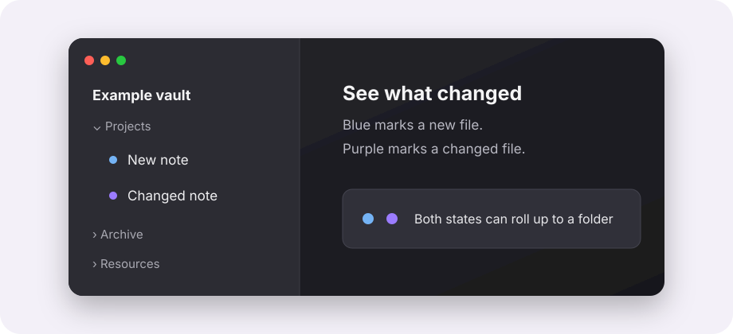

# Unseen Changes Dot

Unseen Changes Dot shows which notes are new and which existing notes changed
since you last viewed them. It adds small markers to the Obsidian file explorer,
parent folders, and background tabs without modifying note frontmatter.



Current packaged version: `1.0.31`.

## What the markers mean

| Marker | Meaning | Default colour |
| --- | --- | --- |
| New | The file was created and has not been viewed yet. | Light blue |
| Changed | A previously viewed file changed while it was not active. | Obsidian accent colour |

Opening a note in the active tab marks its current version as seen. A new file
keeps the stronger `new` state if it changes before you open it.

Folders inherit markers from unseen descendants. A folder can show both states
when it contains both new and changed files.

## Features

- Tracks Markdown files by default.
- Can track attachments when enabled.
- Shows markers in the file explorer and on background tabs.
- Lets you choose which states to show.
- Supports circle, rounded, square, and diamond marker shapes.
- Accepts CSS colours, including Obsidian theme variables.
- Keeps tracking data out of note frontmatter.
- Ignores plugin runtime files and task notes marked with `task` or `tasks`.
- Prunes state for missing files and stale seen-pulse entries.

## Privacy and network access

The plugin does not send data over the network and does not use analytics or
telemetry. At startup it lists Markdown files to detect changes made while the
plugin was not running. If attachment tracking is enabled, that startup list
also includes non-Markdown files. The plugin reads Markdown content when it
needs to calculate a signature.

All persisted state uses Obsidian's plugin data API and stays in the vault
configuration directory.

No note content is written to the tracking files. The stored values contain
paths, timestamps, sizes, signatures, and state used by the plugin.

## Storage and sync

The main state file is:

```text
<vault-config-dir>/plugins/unseen-changes-dot/data.json
```

Per-file seen pulses are stored in:

```text
<vault-config-dir>/plugins/unseen-changes-dot/seen-pulses/
```

If your sync service includes the vault configuration directory, `data.json`
and `seen-pulses/` can sync between devices. The plugin reconciles synced state
against current file signatures.

Do not include runtime state in a release package:

```text
data.json
seen-pulses/
.DS_Store
```

## Settings

- `Shown states`: show new, changed, or both.
- `Track attachments`: off by default.
- `Sync polling interval`: defaults to 5 seconds.
- `Fast startup baseline`: on by default.
- `Unread/new shape` and `Changed shape`: choose the marker shape.
- `Unread/new color` and `Changed color`: set any valid CSS colour.

## Commands

- `Unseen Changes Dot: Show unseen changes status`
- `Unseen Changes Dot: Reset unseen state baseline`
- `Unseen Changes Dot: Show storage debug`
- `Unseen Changes Dot: Mark current file as seen`
- `Unseen Changes Dot: Mark current file as unseen`

## Installation

### Obsidian community plugins

After the plugin is accepted into the community directory:

1. Open `Settings` in Obsidian.
2. Select `Community plugins`, then `Browse`.
3. Search for `Unseen Changes Dot`.
4. Select `Install`, then `Enable`.

### Manual installation

1. Download `main.js`, `manifest.json`, and `styles.css` from the matching
   GitHub release.
2. Create this folder inside the vault configuration directory:

   ```text
   plugins/unseen-changes-dot/
   ```

3. Copy the three files into that folder.
4. Reload Obsidian and enable `Unseen Changes Dot` under `Community plugins`.

Do not enable [Unread Dot](https://github.com/denmojo/obsidian-unread-dot) and
Unseen Changes Dot at the same time. Both plugins add markers to the file
explorer, so enabling both can produce duplicate dots.

If the displayed state looks wrong, run
`Unseen Changes Dot: Reset unseen state baseline` from the command palette.

## Compatibility and limitations

- The minimum supported Obsidian version is `1.4.4`.
- The plugin is designed to avoid Node.js and Electron-only APIs.
- File-explorer markers depend on Obsidian's rendered explorer structure. A
  future Obsidian update may require selector adjustments.
- Attachment signatures use file size and modification time. Markdown files
  use content or metadata signatures, depending on startup mode.

## Development

The repository ships `main.js` directly. It has no runtime dependencies or
compilation step. The build command checks the committed artefact's syntax:

```sh
npm run build
```

Run the checks with Node.js 20 or newer:

```sh
npm run check
```

Prepare an isolated test vault:

```sh
npm run vault:prepare
```

Validate and prepare the release files locally:

```sh
npm run release:prepare
```

The release process is documented in [RELEASING.md](RELEASING.md).

## Credits and licence

Miguel Sousa maintains Unseen Changes Dot. The initial structure and
file-explorer marker approach were based on Dennis Mojado's
[Unread Dot](https://github.com/denmojo/obsidian-unread-dot).

The project is available under the [MIT License](LICENSE). See
[THIRD_PARTY_NOTICES.md](THIRD_PARTY_NOTICES.md) for attribution details.
